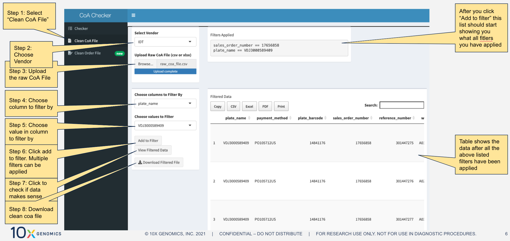

IDT CoA Checker 
----------
v 1.0.0

### Usage

1. Select "Checker" tab in the left side panel.
2. Upload the relevant CoA file.
3. Upload the corresponding Order file.
4. Click on the "Check" button.
5. A report of the analysis should appear on the screen to the right of the buttons. (as shown in the picture below)
6. Click on the "Download" button to download the analysis table to your computer

7. If anything fails, a pop-up message should give more information about the cause of error

### Assumptions

There are a few assumptions that are made within the code. These are explained in detail below

1. Input
    * The input CoA file is a CSV file
    * The input Order file is an XLSX file in the standard IDT order form format is expected
    * Both the files at minimum should contain columns that have "plate name", "well position", "sequence name", "sequence", "concentration", and "volume"
    * Sequences in the CoA file will be checked to see if they match with those present in the order file. So, Order file should contain “all” the relevant plates information of the CoA being checked
    * Order file can contain additional sequences not within the CoA file
2. Checks Done
    * Outputs number of sequences in both files
    * Outputs number of matches of sequences
    * Checks if the “plate_name”, “well_position”, “sequence_name” and “sequence” in both files match with one another
    * Outputs Pass only if all sequences, on the same plate and at the same well position, match with each other.
    * Outputs Pass only if the volumes of the sequences in the CoA are the same or more than at most 20uL than the order file.
    * Outputs Pass only if the concentration of sequences in the order file is within +- 20% of the concentration in the order file.

### Cleaning CoA File

Sometimes, the vendor sends a combined CoA file, for many plates/orders in one file. This cleaning utility was added to the app to make this cleaning easier. And not rely on the manual cut-paste operations.

1. Select "Clean CoA File" tab in the left side panel.
2. Upload the raw CoA File.
3. The selection box labeled "Choose columns to Filter By" should be populated by the column names in the raw CoA file.
4. Choose a column name to filter by.
5. The selection box labeled "Choose values to Filter" should be populated by the unique values in the above selected columns.
6. Choose the appropriate value to filter by.
7. Click on "Add to Filter". The text box on the top right should show the filters selected.
8. Repeat this as many times as needed.
9. Click on "View Filtered Data" to display the filtered data on the right.
10. Click on "Download Clean File" to download the clean CoA file containing only the filtered data.

### Cleaning Order File

Coming soon